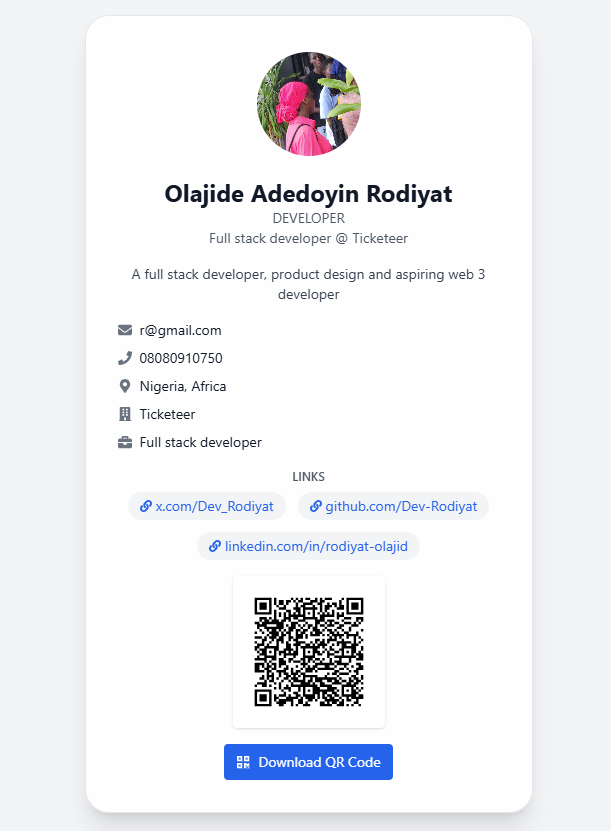
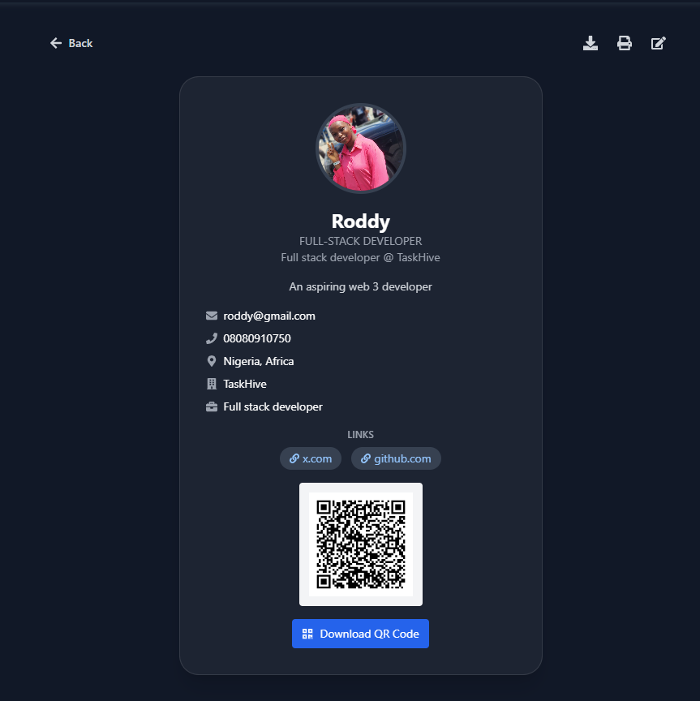

# 💳 Cardence - Digital Business Cards

Cardence is a modern web application that lets you create, share, and manage **digital business cards**. Whether you're networking, attending events, or showcasing your brand, Cardence gives you a smart, stylish way to present yourself.

---

## 🚀 Features

- ✍️ Create customizable digital business cards
- 📇 Add details like name, phone, email, company, position, bio, and links
- 🖼 Upload and display profile images
- 🌐 Share cards with QR codes
- 💾 Save and load cards via localStorage (Web2)
- 🎨 Clean and responsive UI (light/dark mode support)
- 🔍 Filter & manage "My Cards" easily
- ✅ Edit or delete cards with confirmation prompts
- 🔗 Conditional rendering for valid links only

---

## 📦 Tech Stack

- **Frontend:** React + vite
- **Styles:** Tailwind CSS
- **State:** React Context API
- **Icons & QR:** React Icons, qrcode.react
- **Storage:** Browser LocalStorage (Web2)
- **Deployment:** Vercel

---

## 🧠 Getting Started

### 1. Clone the repo

```bash
git clone https://github.com/Dev-Rodiyat/Cardence.git
cd Cardence
````

### 2. Install dependencies

```bash
npm install
```

### 3. Run the app

```bash
npm run dev
```

App will be available at `http://localhost:5173`.

---

## 📸 Screenshots




---

## 📌 TODO / Improvements

### ✅ Web 2 Features (In Progress or Planned)

* [x] Card deletion confirmation modal
* [x] Truncate long bios to 50 characters
* [x] Validate URLs before rendering as links
* [ ] Add drag-and-drop card arrangement
* [ ] Export card as image (screenshot)
* [ ] Improve accessibility (ARIA labels, keyboard nav)
* [ ] Backend sync (Node.js + MongoDB for card persistence)

---

### 🌐 Web 3 Features (Planned)

* [ ] **Wallet Connect login (MetaMask / WalletConnect)**
* [ ] **Store cards as NFTs on Polygon or Base chain**
* [ ] **Upload profile images to IPFS (using web3.storage or nft.storage)**
* [ ] **Card metadata stored on-chain or IPFS**
* [ ] **Token-gated premium card templates**
* [ ] **ENS or Lens integration for Web3 identity**
* [ ] **On-chain QR code registration (card verification)**
* [ ] **Community voting for card designs using a DAO model**

---

## 🤝 Contributing

Contributions are welcome! Please open issues or PRs to suggest improvements.

---

## 🌍 About

**Cardence** was built to modernize how we share professional identity — from static paper cards to dynamic, interactive, and future-proof cards for both Web2 and Web3 environments.
